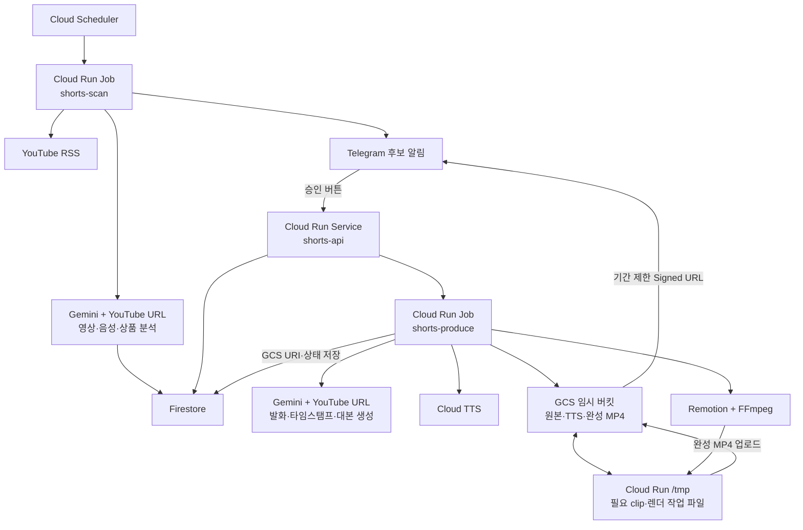

# 연예인 YouTube Affiliate Shorts 자동 제작 시스템 작업 계획

- 문서 성격: 계속 갱신하는 기준 문서
- 최초 작성일: 2026-08-04
- 최종 갱신일: 2026-08-05
- 현재 단계: Vertex AI 분석·Gemini 대본/컷 정규화·Telegram 승인·합성 원본 Cloud Run 렌더 E2E 성공 / 권리 확인된 실제 원본 E2E 대기
- 예상 사용량: 1일 2~3편, 월 60~90편

## 1. 설계 원칙

이 프로젝트의 최우선 기준은 기능 수가 아니라 다음 세 가지다.

1. 복잡하지 않을 것
2. 사용하지 않을 때 비용이 발생하지 않을 것
3. 혼자서 장애 원인을 찾고 고칠 수 있을 것

초기 규모에서는 마이크로서비스, 별도 메시지 브로커, 복잡한 상태 머신을 사용하지 않는다. 실제 사용 중 문제가 확인될 때만 필요한 구성요소를 추가한다.

### 1.1 Gemini-first 영상 분석 원칙

YouTube 내용 분석은 Gemini API의 멀티모달 영상 이해 기능을 최대한 직접 사용한다.

```text
공개 YouTube URL
→ Gemini API가 영상·음성·화면·발화·타임스탬프를 함께 분석
→ 구조화된 상품 evidence 또는 편집 계획 JSON 출력
```

다음과 같은 별도 분석 파이프라인은 만들지 않는다.

- YouTube 자막 API 호출
- YouTube 자동 자막 다운로드
- Whisper 또는 별도 STT
- 분석 목적의 오디오 추출
- 분석 목적의 프레임 추출 및 OCR
- 자막과 영상 타임라인을 다시 결합하는 로직

상품 탐지와 대본 생성 모두 Gemini에 원본 YouTube URL을 직접 전달한다. metadata 필터는 명백히 무관한 영상을 저렴하게 제외하기 위한 용도로만 사용하며, 실제 영상 내용·제품·발화 판단은 Gemini가 담당한다.

렌더를 위한 원본 미디어 확보는 Gemini 영상 분석과 별개의 단계다.

운영 모델은 작업별로 분리한다. 상품 후보 탐색(`get product`)은 비용 효율적인 `gemini-3.5-flash-lite`, 최종 대본·편집 계획 생성은 `gemini-3.5-flash`를 사용한다. 두 모델은 `GEMINI_MODEL`과 `GEMINI_SCRIPT_MODEL` 환경변수로 각각 교체할 수 있다.

후보 탐색 중에는 영상 binary를 다운로드하지 않는다. RSS의 YouTube URL을 Gemini에 전달하고, 타임스탬프 범위 검증을 위해 필요할 때 watch page의 `lengthSeconds` 메타데이터만 조회한다. 실제 binary를 GCS에 저장하는 것은 승인 후 권리 확인된 direct media URL을 렌더할 때뿐이다.

## 2. MVP 목표

```text
RSS 신규 영상 발견
→ Gemini 상품 후보 추출
→ Telegram 후보 알림
→ 제작할 상품만 승인
→ 대본 및 편집 계획 생성
→ TTS 생성
→ 권리 확인된 원본 연결
→ Remotion 렌더
→ Telegram 완성본 검수
```

### 이번 범위에 포함하지 않는 것

- YouTube 자동 업로드
- 별도 운영 대시보드
- Google Sheets 양방향 연동
- 연예인 음성 복제
- 복잡한 통계 및 매출 분석

영상 디자인은 Remotion 템플릿으로 격리해 데이터·분석 로직과 분리한다.

## 3. 최소 아키텍처

### 3.1 필요한 GCP 리소스

| 리소스 | 수량 | 역할 |
|---|---:|---|
| Cloud Run Service | 1 | Telegram webhook과 간단한 API |
| Cloud Run Job | 2 | `shorts-scan`, `shorts-produce` |
| Cloud Scheduler | 1 | `shorts-scan` 매일 03:00(Asia/Seoul) 실행 |
| Firestore | 1 | 채널, 영상, 후보 상태 저장 |
| Cloud Storage | 버킷 1개 | 원본·TTS·완성본의 단기 임시 저장 |
| Secret Manager | 소수 | Telegram 및 Gemini 비밀정보 |
| Artifact Registry | 저장소 1개 | API·Job 컨테이너 이미지 저장 |
| Cloud Build | 배포 시만 | Docker 이미지 2개 빌드 |

Cloud Tasks, Pub/Sub, Workflows, 별도 worker service는 MVP에서 사용하지 않는다. 두 Cloud Run Job은 같은 `Dockerfile.job`을 서로 다른 실행 명령으로 배포한다. GCS는 별도 처리 서비스가 아니라 `shorts-produce`가 직접 읽고 쓰는 임시 작업 저장소로만 사용한다.

### 3.2 전체 흐름



### 3.3 두 Job의 역할

#### `shorts-scan`

한 번 실행될 때 다음을 순차 처리하고 종료한다.

1. Firestore에서 활성 채널 조회
2. 각 채널 RSS 확인
3. 신규 `videoId`만 저장
4. 간단한 metadata 필터 적용
5. 공개 YouTube URL을 Gemini에 직접 전달해 영상·음성·화면을 함께 분석
6. Gemini가 상품 후보, 실제 발화, 장면 근거, 타임스탬프를 JSON으로 출력
7. candidate 저장
8. Telegram 후보 메시지 전송

현재 규모에서는 영상별 작업을 별도 큐에 넣지 않고 한 Job 안에서 순차 처리한다.

#### `shorts-produce`

승인된 candidate 하나를 입력받아 가능한 단계까지 순차 처리하고 종료한다.

1. Firestore transaction으로 중복 실행 방지
2. candidate의 YouTube URL을 Gemini에 다시 전달해 발화와 장면을 직접 재확인
3. Gemini가 대본과 source clip 시작·종료 시점을 포함한 편집 계획 생성
4. 원본 소스와 권리 상태 확인
5. 원본이 없으면 대본만 저장하고 `SOURCE_REQUIRED`로 종료
6. 원본을 GCS `source/`에 임시 저장하고 나레이션 TTS 생성
7. 필요한 source clip과 TTS만 `/tmp`에 준비해 Remotion 렌더
8. 완성 MP4를 GCS `output/`에 업로드
9. GCS URI와 출력 정보를 candidate에 저장
10. 기간 제한 Signed URL을 포함한 Telegram 검수 메시지 전송
11. 성공 시 source·TTS를 즉시 삭제하고, 누락된 정리는 lifecycle에 맡김

하나의 Job에서 대본, TTS, 렌더를 처리해 단계별 서비스와 큐를 만들지 않는다.

## 4. 코드 구조

복잡한 모노레포 패키지 분리는 하지 않고 하나의 Node.js 프로젝트에서 시작한다.

```text
shorts/
├── src/
│   ├── api.ts
│   ├── jobs/
│   │   ├── scan.ts
│   │   └── produce.ts
│   ├── lib/
│   │   ├── firestore.ts
│   │   ├── storage.ts
│   │   ├── gemini.ts
│   │   ├── telegram.ts
│   │   ├── youtube.ts
│   │   ├── tts.ts
│   │   └── schemas.ts
│   └── services/
│       ├── scan-service.ts
│       ├── produce-service.ts
│       ├── media-production-service.ts
│       └── webhook-service.ts
├── base_prompt/
│   ├── get_products.md
│   └── make_transcript.md
├── remotion/
│   ├── Root.tsx
│   ├── ShortsComposition.tsx
│   └── render.ts
├── scripts/
│   ├── import-channels.ts
│   ├── register-source.ts
│   ├── deploy.sh
│   └── set-telegram-webhook.sh
├── Dockerfile.api
├── Dockerfile.job
├── package.json
├── db/
├── legacy/
└── WORK_PLAN.md
```

- `Dockerfile.api`: Telegram webhook에 필요한 가벼운 이미지
- `Dockerfile.job`: Gemini, TTS, FFmpeg, Chromium, Remotion 포함
- `shorts-scan`과 `shorts-produce`는 같은 Job 이미지를 다른 명령으로 실행

초기 배포는 `gcloud` 명령을 감싼 단순 스크립트로 수행한다. Terraform과 GitHub Actions는 MVP 완료 후 필요할 때 추가한다.

## 5. Firestore 최소 데이터 모델

컬렉션은 세 개만 사용한다.

```text
channels/{youtubeChannelId}
videos/{youtubeVideoId}
candidates/{candidateId}
```

별도 `scripts`, `renders`, `telegramUpdates`, `systemLocks` 컬렉션은 만들지 않는다.

### 5.1 `channels`

```text
celebrityName
channelName
channelUrl
youtubeChannelId
enabled
```

### 5.2 `videos`

```text
videoId
channelId
title
videoUrl
publishedAt
durationMs
analyzedAt
analysisStatus
```

문서 ID를 YouTube `videoId`로 사용해 RSS 중복을 자연스럽게 방지한다.

Legacy의 월별 Spreadsheet 탭과 행 번호는 이관하지 않는다. Firestore 문서가 월과 무관하게 계속 누적되며, 월별 조회가 필요하면 `createdAt` 범위 쿼리로 처리한다.

### 5.3 `candidates`

```text
candidateId
videoId
celebrityName
product
status
telegramMessageId
reviewMessageId
scriptText
scriptPlan
scriptRevision
scriptGeneratedAt
sourceAssets[]
sourceUris[]
ttsAssets[]
outputUri
outputSizeBytes
outputDeleteAfter
attemptCount
lastStep
lastError
promptVersion
modelVersion
createdAt
updatedAt
```

`candidateId`는 `videoId + 정규화된 productName의 SHA-256 앞 20자리`로 결정적으로 생성한다. 같은 영상·같은 제품을 다시 분석해도 동일한 문서에 도달하므로 Spreadsheet의 월별 `No.`와 텍스트 매칭이 필요 없다.

대본, 편집 계획, evidence, 렌더 상태는 candidate 문서 안에 함께 저장한다. Firestore에는 텍스트, JSON, 외부 원본 URL과 GCS URI만 저장하고 영상·음성 binary는 저장하지 않는다. Firestore 문서 최대 크기는 1MiB이므로 파싱된 최종 결과만 저장하고 Gemini 원본 응답 전문은 저장하지 않는다.

MVP에서는 최신 대본 한 벌만 보관한다.

```text
scriptText: 사람이 읽는 최종 대본
scriptPlan: Remotion이 사용하는 segment JSON
scriptRevision: 대본 재생성 횟수
scriptGeneratedAt: 생성 시각
```

대본은 일반적으로 수KB 수준이므로 candidate 안에 저장해도 충분하다. 여러 버전의 변경 이력이 실제로 필요해질 때만 별도 `scripts` 컬렉션을 추가한다.

### 5.4 단순 상태 모델

```text
PENDING
APPROVED
PRODUCING
SOURCE_REQUIRED
REVIEW_READY
COMPLETED
FAILED
ARCHIVED
```

- `PENDING`: Telegram 알림 후 승인 대기
- `APPROVED`: 승인됐으나 Job 실행 전
- `PRODUCING`: 대본, TTS 또는 렌더 처리 중
- `SOURCE_REQUIRED`: 원본 소스가 없어 렌더 대기
- `REVIEW_READY`: 완성 영상 검수 대기
- `COMPLETED`: 사용자 확인 완료
- `FAILED`: 오류 발생
- `ARCHIVED`: 오래된 미승인 후보 또는 운영상 보관 처리

별도 거절 상태와 거절 버튼은 사용하지 않는다. 승인하지 않으면 아무 일도 일어나지 않는다.

### 5.5 중복 실행 방지

별도 lock 컬렉션을 만들지 않는다.

Telegram 승인 시 Firestore transaction에서 다음 조건만 검사한다.

```text
현재 status가 PENDING이면 APPROVED로 변경하고 Job 실행
Job 시작 또는 제작 실패 후 같은 버튼으로 재시도할 때는 FAILED도 APPROVED로 변경
그 외 상태면 이미 처리된 요청으로 보고 종료
```

`shorts-produce` 시작 시에도 transaction으로 `APPROVED`, `SOURCE_REQUIRED`, `FAILED` 상태만 `PRODUCING`으로 변경할 수 있게 한다.

## 6. Telegram 동작

### 6.1 후보 메시지

Telegram은 제작할 후보를 고르는 작업함으로만 사용한다.

```text
🛍️ 쇼핑 클립 후보

채널: 고현정
영상: 고현정의 헤어 관리 루틴
제품: 알레시 키친 타이머
근거: "이거 진짜 좋아요."

원본 영상: https://www.youtube.com/watch?v=VIDEO_ID
등장 구간:
- 03:12 바로 보기
- 04:05 바로 보기

[이 제품으로 제작 승인]
```

거절 버튼은 제공하지 않는다.

### 6.2 타임스탬프 딥링크

각 evidence의 `videoId`와 `startMs`로 직접 링크를 만든다.

```text
https://www.youtube.com/watch?v={videoId}&t={floor(startMs / 1000)}s
```

- `03:12`를 누르면 192초 위치에서 재생
- 복수 영상이면 V1, V2별 `videoId` 사용
- 원본 전체 링크도 별도로 제공
- 입력 URL에 문자열을 덧붙이지 않고 `videoId`에서 canonical URL 생성

### 6.3 검수 메시지

```text
🎬 영상 제작 완료

[영상 보기/다운로드]
[완료]
[다시 렌더]
```

`영상 보기/다운로드`는 비공개 GCS 객체의 7일짜리 Signed URL을 사용한다. Signed URL 자체는 Firestore에 저장하지 않고 Telegram 메시지를 보낼 때 생성한다. 50MB 이하와 초과 결과를 나누지 않고 모든 완성본을 같은 방식으로 전달한다. Telegram Bot API의 파일 크기 제한에 렌더 품질을 맞추지 않는다.

대본 재생성, TTS 재생성, 만료 링크 재발급 등 세부 버튼은 실제 필요가 확인된 후 추가한다. MVP에서는 전체 다시 렌더만 제공한다.

## 7. 프롬프트와 렌더 계약

기존 프롬프트의 의도는 유지하되 자유 형식 표 대신 작은 JSON Schema로 출력한다.

중간 transcript 파일은 만들지 않는다.

- 상품 추출: 전체 YouTube 영상 URL + `get-products` 프롬프트
- 대본 생성: 승인된 candidate + 동일 YouTube URL + `make-transcript` 프롬프트
- 복수 영상: 각 URL에 V1, V2 식별자를 부여해 한 요청에서 교차 분석
- 인용과 타임스탬프: Gemini가 영상의 음성과 화면을 직접 확인해 출력

대본 생성 시 상품 추출 결과만 보고 작성하지 않는다. Gemini에 원본 URL을 다시 제공해 승인된 상품의 발화와 구간을 영상에서 재확인하게 한다.

### 7.1 상품 추출 결과

```json
{
  "products": [
    {
      "productName": "알레시 키친 타이머",
      "productNameRaw": "알레시 타이머",
      "brand": "Alessi",
      "category": "생활용품",
      "evidence": [
        {
          "videoId": "VIDEO_ID",
          "startMs": 192000,
          "endMs": 198000,
          "quote": "이거 진짜 좋아요.",
          "kind": "quote"
        }
      ]
    }
  ]
}
```

### 7.2 편집 계획

```json
{
  "title": "고현정이 말한 헤어 루틴",
  "hookTitle": "고현정이 매일 하는\n아침 루틴의 정체",
  "scriptText": "나레이션: 잔머리가 너무 많아 끌어올린다는 고현정. ...",
  "segments": [
    {
      "type": "narration",
      "text": "잔머리가 너무 많아 끌어올린다는 고현정."
    },
    {
      "type": "source_clip",
      "videoId": "VIDEO_ID",
      "sourceStartMs": 192000,
      "sourceEndMs": 198000,
      "subtitle": "이거 진짜 좋아요."
    }
  ]
}
```

### 7.3 샘플 기반 Remotion 디자인 계약

사용자가 전달한 Shorts 샘플 3편의 공통 구조를 기본 템플릿으로 채택한다.

```text
1080 x 1920 / 30fps / 검정 배경
상단 360px: 2줄 hookTitle
  - 첫 줄: 빨강(#f20d18), 핵심 인물·기간·키워드
  - 둘째 줄: 흰색(#ffffff), 궁금증 문구
  - Noto Sans CJK KR 계열, 84px, 900 weight, 검정 외곽선 2px + 그림자
중앙 1080 x 1080: 원본 source clip을 object-fit: cover로 1:1 크롭
본 영상 자막: 중앙 하단, 흰색 굵은 글자 + 검정 외곽선/그림자
하단 480px: 나레이션 자막, 흰색 굵은 글자 + 검정 외곽선/그림자
```

`hookTitle`은 Gemini 대본 생성 응답에서 함께 만들며 2줄 이내 실제 개행을 포함한다. 기존 scriptPlan에 `hookTitle`이 없으면 `title`을 fallback으로 사용해 이미 저장된 대본도 렌더할 수 있다. 폰트 파일을 별도 다운로드하지 않고 Cloud Run 이미지의 `fonts-noto-cjk`를 사용한다.

Remotion은 candidate의 `scriptPlan`을 읽고, GCS에서 `/tmp`로 준비한 source clip과 TTS 파일을 사용해 렌더한다. 별도 manifest 파일과 영구 TTS 파일은 반드시 필요해질 때까지 만들지 않는다.

## 8. 원본 소스 원칙

Gemini가 YouTube URL을 분석할 수 있는 것과 해당 영상을 상업적으로 다운로드·재편집할 수 있는 것은 별개다.

- 렌더에는 권리 확인된 `sourceAssets`만 사용
- 원본이 없으면 대본만 저장하고 `SOURCE_REQUIRED`에서 종료
- 연예인 발화는 원본 오디오 사용
- TTS는 관찰자 나레이션에만 사용
- 원본 취득 방식은 Phase 4 시작 전에 별도로 확정

### 8.1 GCS 기반 임시 미디어 처리

GCS 버킷 하나를 Cloud Run과 같은 `asia-northeast3` 리전에 만들고 Standard Storage만 사용한다. 같은 리전의 Cloud Run과 GCS 사이 전송에는 별도 데이터 전송 요금이 없다. 버킷은 공개하지 않으며 `shorts-produce` 서비스 계정만 객체를 읽고 쓸 수 있게 한다. Signed URL은 서비스 계정 키 파일을 만들지 않고 IAM `signBlob` 권한으로 생성한다.

```text
gs://{bucket}/source/{candidateId}/original.*
gs://{bucket}/tts/{candidateId}/narration.*
gs://{bucket}/output/{candidateId}/output.mp4
```

처리 흐름:

```text
권리 확인된 원본 URL → GCS source/로 스트리밍 업로드
Gemini 편집 계획 → 필요한 source clip만 /tmp에 준비
TTS 원본은 GCS에 저장하고 렌더용 파일은 /tmp에 준비
Remotion 출력은 /tmp에서 생성 → GCS output/ 업로드
Telegram에는 완성본 Signed URL 전달
성공 시 source/와 tts/ 객체 즉시 삭제
실패나 중단으로 남은 객체는 lifecycle이 정리
```

GCS가 `/tmp`를 완전히 대체하지는 않는다. Chromium과 FFmpeg가 안정적으로 처리할 수 있도록 렌더 중인 clip, TTS, 중간 파일, 최종 MP4는 Cloud Run Job에 마운트한 전용 in-memory volume에 두되 전체 원본은 올리지 않는다. `TMPDIR=/mnt/render-tmp`로 지정하고 volume 자체에 3GiB hard limit을 적용한다.

초기 안전 설정:

```text
shorts-scan: 1 vCPU / 1 GiB
shorts-produce: 4 vCPU / 8 GiB
MAX_TEMP_BYTES: 3 GiB
완성 MP4: Telegram 50MB 기준으로 품질을 강제 축소하지 않음
```

`MAX_TEMP_BYTES`는 작업 volume에 동시에 존재하는 clip, TTS, 중간 파일, 완성 MP4의 합계 기준이다. 애플리케이션 검사와 3GiB volume limit을 함께 사용한다. 첫 실영상 3편에서 메모리 부족이 재현될 때만 16GiB로 올린다. Cloud Run Jobs의 별도 ephemeral disk는 MVP에서 사용하지 않는다.

### 8.2 버킷 보관·삭제 정책

버킷 수를 늘리지 않고 object prefix별 lifecycle rule을 사용한다.

| Prefix | 정상 처리 | Lifecycle 안전망 |
|---|---|---|
| `source/` | 렌더 성공 직후 삭제 | 생성 2일 후 삭제 |
| `tts/` | 렌더 성공 직후 삭제 | 생성 2일 후 삭제 |
| `output/` | Telegram 검수 링크로 사용 | 생성 14일 후 삭제 |
| 미완료 multipart upload | 해당 없음 | 1일 후 중단·삭제 |

Lifecycle 삭제는 즉시 실행이 보장되지 않으므로 정상 경로에서는 애플리케이션이 먼저 삭제하고 lifecycle은 누락 방지용으로만 사용한다.

임시 객체가 삭제된 뒤 기본 7일간 다시 과금되는 일을 막기 위해 이 버킷은 다음과 같이 설정한다.

- soft delete 비활성화
- Object Versioning 비활성화
- retention policy와 Bucket Lock 사용 안 함
- Autoclass 사용 안 함
- Uniform bucket-level access 사용

복구가 꼭 필요한 영구 산출물이 생기면 임시 버킷 정책을 바꾸지 않고 별도 영구 보관 위치를 추가한다.

### 8.3 예상 GCS 비용

서울 리전 Standard Storage는 대략 `$0.02/GiB-month` 수준이고 실제 저장 시간에 비례해 과금된다. 서울 리전은 Cloud Storage 5GB-month Always Free 대상 리전은 아니지만, 현재 물량에서는 저장비가 매우 작다.

보수적으로 월 90편, 원본 1GiB를 매번 2일간 전부 보관하고 완성본 100MiB를 14일 보관한다고 가정하면 평균 저장량은 약 10.2GiB-month이고 저장비는 대략 월 `$0.20` 전후다. 정상 처리 후 원본을 즉시 삭제하면 더 낮아진다. 작업 요청 비용은 이 규모에서 미미하다.

다만 사용자가 GCS Signed URL에서 영상을 내려받는 트래픽은 인터넷 egress 과금 대상이다. 완성본 100MiB × 월 90편을 각 1회 다운로드하면 약 9GiB/월이므로 저장비보다 네트워크 비용이 더 클 수 있지만 여전히 소액 범위다. 정확한 금액은 실제 평균 원본·출력 크기와 다운로드 횟수로 첫 달에 확인한다.

## 9. 단계별 구현 계획

### Phase 0. 보안과 프로젝트 골격

- 상태: `IN_PROGRESS` — GCP 리소스 생성 완료, 실제 운영 source 검증 전
- 예상: 1일

작업:

- [ ] 노출된 기존 Telegram Bot Token 폐기 및 재발급
- [x] Secret Manager 실제 등록 (`scripts/create-secrets.sh` 구현 완료)
- [x] 서울 리전 Standard GCS 임시 버킷 1개 생성
- [x] Uniform bucket-level access, lifecycle, soft delete 비활성화 적용
- [x] `shorts-produce` 서비스 계정의 bucket-level object 권한과 IAM `signBlob` 권한 구성
- [x] 단일 TypeScript 프로젝트 생성
- [x] API와 Job Dockerfile 생성
- [x] 환경변수 검증과 기본 로깅
- [x] 로컬 실행 명령 구성
- [x] Secret 등록·배포·webhook 설정을 묶은 단일 bootstrap 명령
- [x] Telegram/Gemini 읽기 전용 credential preflight

완료 조건:

- 비밀값이 코드에 없음
- 버킷이 비공개이고 서비스 계정만 객체에 접근 가능
- 서비스 계정 키 파일 없이 Signed URL 생성 가능
- `source/`, `tts/`, `output/` lifecycle 규칙이 적용됨
- API, scan, produce 명령이 로컬에서 시작됨

### Phase 1. Firestore와 RSS scan

- 상태: `COMPLETED` — RSS→Firestore 중복 방지와 Cloud Run Job 실행 확인. 존재하지 않는 채널 feed 오류는 개별 기록 후 다음 채널로 진행
- 예상: 2~3일

작업:

- [x] 채널 XLSX importer
- [x] 세 컬렉션 schema 구현
- [x] RSS parser
- [x] `videoId` 중복 방지
- [x] metadata 사전 필터와 24시간 lookback(장애 복구 시 설정으로 확장)
- [x] `shorts-scan` Job 배포
- [x] Scheduler 연결

완료 조건:

- 신규 영상만 Firestore에 한 번 저장됨
- 특정 채널 오류가 전체 scan을 멈추지 않음

### Phase 2. Gemini 후보 추출과 Telegram 알림

- 상태: `COMPLETED` — Vertex 실제 영상 분석과 RSS→후보→Telegram 전체 경로 확인
- 예상: 3~4일

작업:

- [x] `get_products.md` JSON 출력 계약 추가
- [x] 공개 YouTube URL을 직접 입력하는 Gemini API 호출
- [x] 영상·음성·화면을 한 요청에서 분석
- [x] 실제 발화, 장면 근거, 시작·종료 타임스탬프를 함께 출력
- [x] candidate 생성
- [x] Telegram 후보 메시지
- [x] 원본 링크와 evidence 딥링크
- [x] Telegram webhook secret 및 chat allowlist
- [x] Cloud Run Job에서 Vertex YouTube 영상 분석 성공 확인(실제 영상 E2E는 `gemini-2.5-flash-lite`로 검증; 운영 `gemini-3.5-flash-lite` endpoint preflight 완료)

완료 조건:

- 하나의 영상에서 복수 상품이 별도 candidate로 생성됨
- 별도 자막·STT·프레임 추출 없이 Gemini 결과만으로 evidence가 생성됨
- 모든 타임스탬프 링크가 해당 영상 위치로 이동함
- 후보가 Telegram에 중복 전송되지 않음

### Phase 3. 승인, 대본, TTS

- 상태: `IN_PROGRESS` — 승인 webhook·실제 Gemini 대본/컷 생성·저장 대본 기반 TTS E2E 성공, 권리 확인 원본 연결 전
- 예상: 3~4일

작업:

- [x] 단일 승인 버튼
- [x] Firestore transaction 멱등 처리
- [x] `shorts-produce` Job 실행 API
- [x] `make_transcript.md` JSON 출력 계약 추가
- [x] 승인된 candidate와 원본 YouTube URL을 Gemini에 함께 전달
- [x] Gemini가 원본 영상을 다시 분석해 실제 발화와 clip 범위를 재확인
- [x] 대본과 편집 segment 생성
- [x] 나레이션 TTS 구현
- [x] candidate 문서에 결과 저장
- [x] Vertex 응답 변형에서 `[V1 00:02]` timestamp source clip fallback

완료 조건:

- 승인 버튼을 여러 번 눌러도 Job이 한 번만 시작됨
- 나레이션과 실제 발화가 구분됨
- 실제 발화에 영상 ID와 시작·종료 시점이 존재함
- 별도 transcript 파일 없이 편집 계획이 생성됨

### Phase 4. 원본 연결과 로컬 Remotion

- 상태: `IN_PROGRESS` — 샘플 레이아웃·로컬 렌더·합성 원본 통합 렌더 완료, 권리 확인된 운영 source E2E 전
- 예상: 3~5일

작업:

- [x] 권리 확인된 direct media URL 등록 방식 구현
- [x] remote `sourceAssets`, GCS `sourceUris`, `rightsStatus` 구현
- [x] 원본을 GCS로 스트리밍 업로드하고 필요한 clip만 `/tmp`에 준비
- [x] 1080x1920, 30fps 기본 Composition
- [x] source clip, TTS, 기본 자막
- [x] 샘플 기반 상단 hookTitle·중앙 1:1 crop·하단 자막 레이아웃
- [x] H.264/AAC 출력
- [x] narration fixture 로컬 전체 렌더
- [x] FFmpeg 실파일 컷 추출 → 자막·나레이션 → Remotion 통합 렌더와 ffprobe 검증

완료 조건:

- 권리 확인된 원본만 렌더됨
- 디자인 미확정 상태에서도 기본 MP4 생성 가능
- script segment, TTS, 자막 시간 순서가 맞음

### Phase 5. Cloud Run 렌더와 Telegram 검수

- 상태: `IN_PROGRESS` — 합성 원본 승인→GCS→TTS→Remotion→Telegram 검수 E2E 성공, 실제 권리 원본 대기
- 예상: 3~4일

초기 렌더 설정:

```text
4 vCPU
8 GiB memory
30분 timeout
1 retry
parallelism 1
Remotion concurrency 2
MAX_TEMP_BYTES 3 GiB
```

작업:

- [x] Job image에 FFmpeg, Chromium, Remotion 포함
- [x] `shorts-produce` Cloud Run Job 렌더 코드
- [x] 임시 파일 byte 상한 및 중간 파일 정리
- [x] 3GiB hard limit의 전용 in-memory 작업 volume 구성
- [x] 완성 MP4를 GCS `output/`에 업로드하고 URI 저장
- [x] source·TTS 정상 삭제와 lifecycle fallback 구성
- [x] 기간 제한 Signed URL을 포함한 Telegram 완성본 알림
- [x] 완료 및 전체 다시 렌더 버튼
- [ ] Legacy Apps Script trigger 종료
- [x] Telegram webhook 운영 전환

완료 조건:

- 승인부터 완성본 Telegram 전달까지 자동으로 연결됨
- 실패 시 candidate에 `lastStep`, `lastError`가 남음
- 전체 다시 렌더가 중복 결과를 만들지 않음

## 10. 최소 테스트

초기에는 다음만 자동화한다.

- RSS parser 단위 테스트
- YouTube timestamp URL 생성 테스트
- Telegram 승인 상태 전이 및 중복 클릭 테스트
- Gemini JSON schema 테스트
- 편집 plan schema 테스트
- 10초 fixture 영상 로컬 렌더 테스트
- staging bot 기준 E2E 1개

대규모 load test, 시각 snapshot test, Firestore emulator 기반 전체 통합 테스트는 실제 필요가 생긴 후 추가한다.

### 10.1 2026-08-05 로컬 검증 결과

| 검증 | 결과 |
|---|---|
| `pnpm typecheck` | 통과 |
| `pnpm test` | 12 files, 35 tests 통과 |
| `pnpm build` | 통과 |
| 채널 XLSX dry-run | 유효 161개, Channel ID 누락 2개 제외 확인 |
| `pnpm test:render` | 10.048초, 1080x1920, 30fps, H.264/AAC |
| `pnpm test:media` | 실파일 컷 추출 후 3.05초 통합 렌더, 1080x1920, 30fps, H.264/AAC |
| shell script syntax | 통과 |
| GCP project/auth preflight | `honeytong` project와 gcloud 계정 인증 확인 |
| Firestore default database | `asia-northeast3`, Native, Standard, free tier 확인 |
| Telegram/Gemini credential preflight | Telegram `getMe`, Gemini `gemini-3.5-flash` model 조회 성공 |
| Gemini live video analysis | GCP Vertex AI YouTube 영상 분석 Job 성공(당시 `gemini-2.5-flash-lite`), 상품 1개·evidence 2개·약 3,320 tokens 확인 |
| Gemini model split preflight | Vertex `gemini-3.5-flash-lite` 상품 모델과 `gemini-3.5-flash` 대본 모델의 global endpoint text 응답 및 `modelVersion` 확인 |
| YouTube feed fallback | RSS 404를 재현하고 공개 YouTube `browse` 응답에서 최신 영상 ID·제목·상대 게시일을 추출하는 회귀 테스트 및 실제 채널 호출 확인. Cloud Run smoke 실행도 `feedErrors=0`으로 완료 |
| Gemini live script generation | 실제 승인 candidate에서 Vertex 대본 생성 후 `SOURCE_REQUIRED`까지 진행, `source_clip` 6개와 timestamp subtitle 저장 확인 |
| Gemini response compatibility | Vertex 배열/snake_case, transcript utterance, scriptText timestamp fallback 변형 정규화 코드와 회귀 테스트 통과 |
| GCP 운영 배포 | `honeytong`에 Cloud Run API revision `shorts-api-00025-rcq`, Job 2개, Scheduler, GCS, Secret Manager, Artifact Registry 배포 완료; 최신 Job 이미지 `manual-202608051710`; scan Job의 채널 import 성공 |
| RSS scan live E2E | 최신 `shorts-scan` Job을 1개 영상으로 제한 실행해 RSS 발견→Vertex 분석→Firestore `ANALYZED`→후보 5개 생성→Telegram 메시지 전송을 확인. 미승인 후보는 모두 `PENDING`으로 유지되고 produce Job은 시작되지 않음 |
| YouTube timestamp guard | 후보 탐색 중 영상 파일 없이 watch-page `lengthSeconds`만 조회하고 evidence를 영상 길이로 제한. 15:47 영상에서 20~21분 evidence 후보를 차단·ARCHIVED 처리하고 잘못된 Telegram 메시지 삭제 |
| Render source duration guard | 렌더 전 권리 확인 source를 `ffprobe`로 확인하고 Gemini clip 범위가 실제 source 길이를 넘으면 중단. 공개 direct MP4 probe(14,040ms)와 순수 검증 테스트 통과 |
| Telegram 운영 webhook | `shorts-api` `/telegram/webhook`으로 설정, pending update 0 확인 |
| 후보 승인 E2E | 단일 승인 callback이 Firestore 상태 전환 및 `shorts-produce` 실행으로 이어지는 경로 확인 |
| Cloud Run media E2E | 합성 4초 원본으로 source GCS staging, Cloud TTS, FFmpeg clip, Remotion 1080x1920 H.264/AAC 렌더, GCS output 2.4MB, Telegram review 알림 성공; 테스트 후 공개 bucket binding 제거 |
| 비용 가드 | 프로젝트 월 ₩16,000 알림 예산 생성(`EXCLUDE_ALL_CREDITS`, 50/80/100%); 일반 Budget은 자동 중지 기능이 아니므로 별도 spend cap은 사용자가 Console에서 확인 |

현재 `honeytong`의 운영 배포와 Telegram webhook(`/health` 200, 잘못된 secret 401)은 완료됐다. 실제 권리 확인 원본을 연결한 운영 렌더만 남아 있다. 로컬 Docker는 설치하지 않고 실제 컨테이너 빌드는 Cloud Build에서 검증한다. `shorts-produce`와 `shorts-scan`은 `manual-202608051710` 이미지로 재배포되어 timestamp guard, 인물명 상품 오탐 필터, RSS browse fallback, 모델 분리, 렌더 source duration guard가 반영됐다. 두 Job의 `SCAN_LOOKBACK_HOURS=24` 설정과 API `shorts-api-00025-rcq` revision을 확인했다. `pnpm audit`에는 `@google-cloud/storage → gaxios → uuid@9`의 moderate advisory 1건이 남아 있다. 취약 함수는 의존 패키지에서 사용되지 않고 `uuid.v4()`만 호출하므로 강제 major override로 호환성 위험을 만들지 않고 upstream 갱신을 기다린다.

## 11. 비용과 복잡성 방지 규칙

- Cloud Run은 `min instances=0`
- Scheduler는 처음 1~2시간 간격
- Firestore는 default database 하나
- GCS는 서울 리전 Standard 단일 버킷만 사용
- GCS의 soft delete, versioning, Autoclass는 사용하지 않음
- 원본과 TTS는 성공 직후 삭제하고 lifecycle을 누락 방지 안전망으로 사용
- `/tmp`에는 렌더에 필요한 파일만 두고 총 사용량은 3GiB를 넘기지 않음
- GPU 사용 금지, CPU 렌더부터 측정
- scan은 순차 실행
- produce Job parallelism은 1부터 시작
- Gemini 호출 전 metadata 필터
- 긴 데이터가 실제로 생기기 전에는 별도 컬렉션과 외부 JSON 저장소를 만들지 않음
- 실패 재시도는 Cloud Run Job 1회와 Telegram 수동 다시 렌더로 제한
- 운영 중 불편이 확인되기 전에는 새 GCP 서비스를 추가하지 않음

## 12. 나중으로 미룬 항목

다음은 MVP에서 만들지 않는다.

- Cloud Tasks
- Pub/Sub
- Workflows
- 영구 미디어 저장소
- Terraform
- GitHub Actions 배포
- Gemini provider abstraction
- YouTube 자막 API 또는 자막 다운로드
- Whisper 및 별도 STT 서비스
- 분석 목적의 오디오·프레임 추출 파이프라인
- 별도 scripts 또는 renders 컬렉션
- 별도 notification event 저장소
- 분산 lock
- 운영 dashboard
- 자동 archive Job
- 다단계 모델 fallback
- 실시간 비용 집계
- YouTube 자동 업로드

### 추가 조건

| 기능 | 추가를 검토할 조건 |
|---|---|
| Cloud Tasks | 한 Job의 순차 처리 시간이 길어지거나 개별 재시도가 필요할 때 |
| 별도 영구 보관 버킷 | 완성본을 14일보다 오래 보관하거나 게시 원본으로 지속 제공해야 할 때 |
| 별도 render 컬렉션 | 후보당 여러 렌더 이력을 반드시 보존해야 할 때 |
| GitHub Actions | 배포 빈도가 높아 수동 배포가 불편할 때 |
| Terraform | 리소스 재생성이 필요하거나 운영 환경이 여러 개가 될 때 |
| 운영 dashboard | Telegram과 GCP Console만으로 상태 파악이 어려울 때 |
| 고급 모델 fallback | 저가 모델의 실제 실패율이 허용 범위를 넘을 때 |

## 13. MVP 완료 기준

- [x] RSS 신규 영상이 중복 없이 수집됨
- [x] Gemini 상품 후보가 JSON schema로 저장됨
- [x] 별도 자막·STT 없이 Gemini가 YouTube URL에서 발화와 장면을 직접 분석함
- [x] Telegram 원본 링크와 타임스탬프 링크가 동작함
- [x] 제작할 후보만 단일 승인 버튼으로 승인 가능
- [x] 미승인 후보는 어떤 후속 작업도 만들지 않음
- [x] 대본과 TTS가 생성됨 (실제 Gemini 자동 생성 및 저장된 `scriptPlan` 기반 TTS E2E)
- [x] 권리 확인된 원본만 사용됨 (candidate.sourceAssets filter rightsStatus === "CONFIRMED" 및 duration guard 구현)
- [x] Cloud Run Job에서 Remotion MP4가 생성됨 (합성 원본 smoke test)

- [x] 원본·TTS·완성본이 GCS lifecycle 정책에 따라 정리됨
- [x] 50MB 초과 여부와 무관하게 완성본 Signed URL이 Telegram으로 전달됨
- [x] 실패 원인을 candidate 문서와 Cloud Logging에서 확인 가능

운영 확인 전제:

- Cloud Billing의 일반 Budget은 알림만 제공하며 후불 청구를 자동으로 차단하지 않는다. 사용자가 Cloud Console의 Preview spend cap을 별도로 설정하지 않는 한, ₩16,000 도달 시 이메일/Pub/Sub 알림만 발생한다.

## 14. 변경 이력

| 날짜 | 변경 내용 |
|---|---|
| 2026-08-04 | 최초 계획 작성 |
| 2026-08-04 | Telegram 거절 기능 제거, evidence별 YouTube 타임스탬프 딥링크 추가 |
| 2026-08-04 | 저비용·단순성 재검토. Cloud Tasks, 다수 컬렉션, lock, Terraform, 초기 GitHub Actions를 제거하고 Cloud Run Service 1개 + Job 2개 + Firestore 3컬렉션 구조로 축소 |
| 2026-08-04 | Gemini-first 원칙 확정. YouTube URL을 Gemini에 직접 전달하고 자막 API, Whisper, 별도 STT·오디오·프레임 추출 분석 파이프라인을 제외 |
| 2026-08-04 | MVP에서 GCS 제거. Cloud Run 임시 파일로 렌더 후 Telegram에 MP4를 직접 업로드하고 `file_id`만 Firestore에 저장하도록 단순화. worker 용어를 Cloud Run Job으로 통일 |
| 2026-08-04 | Cloud Run `/tmp`가 메모리를 공유한다는 제한을 반영. produce Job을 16GiB, 임시 파일 안전 상한을 6GiB로 설정하고 대본·편집 계획의 Firestore 저장 필드를 명시 |
| 2026-08-04 | 50MB 초과 완성본과 대용량 원본을 고려해 GCS 단일 임시 버킷을 복원. source·TTS는 성공 직후 삭제, output은 14일 후 삭제하고 Telegram에는 Signed URL을 전달하도록 변경 |
| 2026-08-04 | 단기 데이터 비용을 줄이기 위해 GCS soft delete·versioning·Autoclass를 끄고, 서울 단일 리전 Standard Storage와 prefix별 lifecycle을 사용하도록 확정 |
| 2026-08-04 | 전체 원본을 `/tmp`에 두지 않는 구조에 맞춰 produce 초기 설정을 4 vCPU·8GiB, `/tmp` 3GiB로 낮추고 실영상에서 부족할 때만 증설하도록 조정 |
| 2026-08-04 | Legacy 월별 Spreadsheet 탭과 행 번호를 제거하고, Firestore `videoId` 및 deterministic `candidateId`로 중복을 방지하도록 확정 |
| 2026-08-04 | 사용자 확인에 따라 self-hosted Remotion Node.js 렌더러를 유지하고 FFmpeg-only 전환은 하지 않기로 확정 |
| 2026-08-05 | Cloud Run Service/Jobs, Firestore, Gemini, Telegram 승인, GCS 임시 미디어, TTS, FFmpeg 컷 편집, Remotion 렌더의 MVP 코드를 구현하고 로컬 검증 단계로 전환 |
| 2026-08-05 | 10초 fixture 및 실제 source clip 통합 렌더를 1080x1920·30fps·H.264/AAC로 검증하고 Cloud Run Job override 권한을 최소 전용 역할로 교정 |
| 2026-08-05 | Firestore와 충돌하던 legacy 시트 프롬프트 지시를 제거하고 Gemini JSON Schema 정규화·semantic retry, 배포 회귀 테스트, 3GiB 제한 작업 volume, 단일 bootstrap 스크립트를 추가 |
| 2026-08-05 | Billing 연결 후 프로젝트 월 ₩16,000 알림 Budget을 생성하고 Cloud Run API/Jobs·GCS·Scheduler·Telegram webhook 운영 배포를 완료. Cloud Run CLI의 `--max` 호환성 오류를 `--max-instances`로 수정 |
| 2026-08-05 | Cloud Run 외부 프런트엔드가 예약하는 `/healthz`를 피하도록 `/health` probe 경로를 추가하고 새 API/Job 이미지를 재배포. `/health` 200, webhook 인증 401/invalid update 200, 채널 import Job 성공 확인 |
| 2026-08-05 | 저장된 `scriptPlan`이 있는 source 등록·재렌더는 Gemini를 다시 호출하지 않도록 멱등 경로와 테스트를 추가. 실제 Gemini 호출은 AI Studio 선불 크레딧 보충 후 재시도 필요 |
| 2026-08-05 | GCP 선불 Billing을 사용할 수 있도록 Gemini provider를 `api`/`vertex` 선택형으로 확장. Vertex AI global `gemini-3.5-flash-lite` 상품 탐색·`gemini-3.5-flash` 대본 생성·저해상도 영상 입력·Cloud Run 서비스 계정 IAM을 구성하고 두 모델의 endpoint preflight를 확인 |
| 2026-08-05 | Vertex SDK를 v1로 고정하고 Vertex의 JSON MIME 응답을 로컬 Zod로 검증하도록 조정. 실제 YouTube 영상 분석 Job 성공을 확인했으며, Vertex 응답의 배열·snake_case 변형도 내부 계약으로 정규화 |
| 2026-08-05 | Vertex `MEDIA_RESOLUTION_LOW`를 실제 요청에 적용해 샘플 호출에서 약 14.9K prompt tokens 사용을 확인(기본 해상도 호출 약 42K 대비 감소). |
| 2026-08-05 | 제공된 Shorts 샘플을 기준으로 `hookTitle`을 대본 응답에 추가하고, 상단 2줄 타이틀·빨강/흰색 강조·검정 외곽선·중앙 1:1 crop·하단 나레이션 자막 Remotion 템플릿을 반영 |
| 2026-08-05 | Vertex 실제 샘플 분석에서 상품 1개와 evidence 2개를 확인하고, 단일 승인 callback이 Firestore 상태 전환 및 produce Job 실행으로 이어지는 E2E를 검증 |
| 2026-08-05 | 4초 합성 원본으로 GCS staging·Cloud TTS·FFmpeg 컷·Remotion 렌더·GCS output·Telegram review까지 Cloud Run media E2E를 완료. 테스트용 공개 bucket binding은 검증 후 제거 |
| 2026-08-05 | Vertex의 `edit_plan`·`segment_type`·snake_case 응답을 내부 `scriptPlan`으로 정규화하고 회귀 테스트를 26개로 확대 |
| 2026-08-05 | Vertex가 구조화된 edit plan 대신 transcript/placeholder를 반환하는 변형을 확인하고, utterance timestamp 및 대본 `[V1 00:02]` 표기에서 source clip을 복원하도록 보정. 회귀 테스트 28개와 실제 `shorts-produce` 실행으로 검증 |
| 2026-08-05 | 최신 `shorts-scan`을 1개 영상 제한으로 실행해 RSS→Vertex→Firestore→Telegram 자동 경로를 검증하고, 미승인 후보의 produce 미실행을 확인 |
| 2026-08-05 | Vertex 모드에서 불필요한 Gemini API 키를 요구하지 않도록 bootstrap·Secret·deploy 스크립트를 provider 조건부로 보완 |
| 2026-08-05 | 후보 탐색 중 영상 binary를 받지 않고 YouTube watch-page 길이 메타데이터만 조회해 timestamp를 검증하도록 추가. 실제 15:47 영상의 20~21분 오탐 후보를 차단·정리하고 회귀 테스트를 32개로 확대 |
| 2026-08-05 | timestamp guard가 포함된 Cloud Run API revision `shorts-api-00022-9p4`와 `shorts-scan`/`shorts-produce` Job 이미지 `manual-202608051520` 재배포 |
| 2026-08-05 | Gemini 상품 모델을 `gemini-3.5-flash-lite`, 최종 대본 모델을 `gemini-3.5-flash`로 분리하고 `manual-202608051630` 이미지·API revision `shorts-api-00023-45b`로 재배포. 인물명 `허경환`·`이민정` 오탐 후보는 필터로 차단·ARCHIVED 처리하고 알림을 삭제 |
| 2026-08-05 | YouTube RSS가 채널별 404를 반환하는 운영 상태를 확인하고, 무키 공개 `youtubei/v1/browse` fallback 및 상대 게시일 파서를 추가. RSS가 복구되면 기존 경로를 우선 사용 |
| 2026-08-05 | 일일 1회 배치 운영에 맞춰 Scheduler를 매일 03:00(Asia/Seoul)로 변경하고 기본 lookback을 72시간에서 24시간으로 축소. Firestore video 문서는 binary/history가 아니라 분석 멱등성·후보 원본 메타데이터로만 유지 |
| 2026-08-05 | 렌더 전 direct source의 실제 길이를 `ffprobe`로 확인하고, 필요한 source video만 GCS에 staging하도록 최적화. 범위를 벗어난 source clip은 렌더 전에 실패 처리 |
| 2026-08-05 | 저장소 상태 점검 및 인수인계 문서 HANDOFF.md 작성. pnpm typecheck, vitest 35개 테스트, build, Remotion fixture 렌더 및 FFmpeg 미디어 파이프라인 검증 통과 완료 |
| 2026-08-05 | 롱폼 전용 스캔 옵션 EXCLUDE_SHORTS 및 MIN_LONG_FORM_SECONDS 구현. #shorts/#쇼츠 해시태그 및 60초 이하 숏폼 사전 스킵 처리와 단위 테스트 37개 통과 확인 |


## 15. 공식 문서 참고

- [Cloud Storage 가격](https://cloud.google.com/storage/pricing)
- [Object Lifecycle Management와 `matchesPrefix`](https://cloud.google.com/storage/docs/lifecycle)
- [Cloud Storage soft delete](https://cloud.google.com/storage/docs/soft-delete)
- [soft delete 비활성화](https://cloud.google.com/storage/docs/disable-soft-delete)
- [서비스 계정으로 V4 Signed URL 생성](https://cloud.google.com/storage/docs/access-control/signing-urls-with-helpers)
- [Telegram Bot API `sendVideo`](https://core.telegram.org/bots/api#sendvideo)
- [Gemini 공개 YouTube URL 영상 이해](https://ai.google.dev/gemini-api/docs/video-understanding)
- [Cloud Run Job 실행 인자 override](https://cloud.google.com/sdk/gcloud/reference/run/jobs/execute)
- [Cloud Run Jobs Executor With Overrides 역할](https://cloud.google.com/run/docs/reference/iam/roles)
